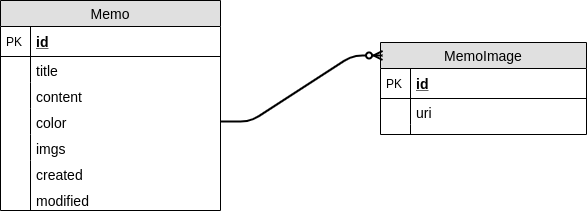

# SimpleMemoJ

간단하게 사진을 저장하고, 메모를 작성할 수 있는 안드로이드 애플리케이션입니다.

 

## Features

* 언제든지 메모를 작성하고 볼 수 있습니다.
* 메모에 여러 개의 사진을 저장할 수 있습니다.
* 메모의 색상을 제공하여 다채로운 UI를 제공합니다.

 

## ERD

메모에서 필요한 기본적인 내용과 거기에 추가로 복수 개의 이미지를 삽입할 수 있도록 1:N 형태의 데이터 구조를 사용합니다.

 

## Library

해당 앱에서는 MVP 패턴을 사용하였고, 뷰 바인딩을 위하여 ButterKnife, 메모 이미지를 로딩하는 데 필요한 Glide 라이브러리를 사용하였습니다.

* ButterKnife
* Glide

